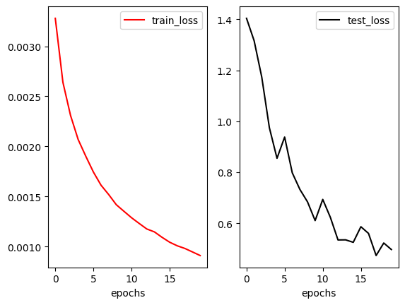
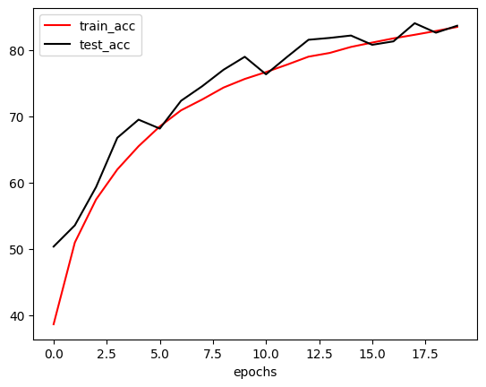
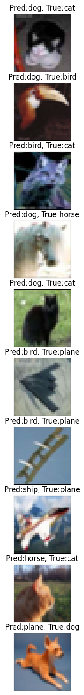
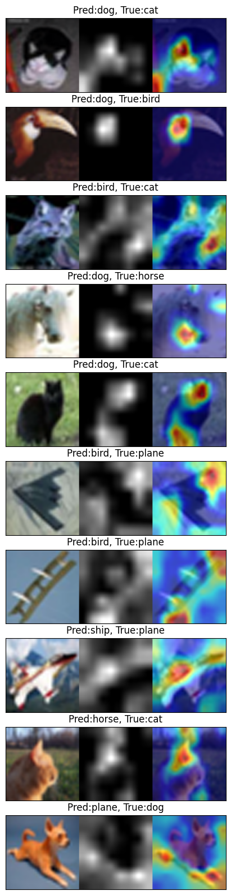

__Objective__

- Application of Multiple variants of Resnet Model for the task of Cifar-10 classification
- Train till 20 epochs with and without One Cycle Policy
- show loss curves for test and train datasets
- show a gallery of 10 misclassified images
- show gradcamLinks output on 10 misclassified images.
- Modular Code structure under scripts
- Process Orchestration in notebook


__Training log__


From 15 th epoch onwards..

```text


EPOCH: 15
Loss=0.5054177641868591 Batch_id=97 Accuracy=81.16: 100%|██████████| 98/98 [00:50<00:00,  1.95it/s]

Test set: Average loss: 0.5864, Accuracy: 8082/10000 (80.82%)

EPOCH: 16
Loss=0.46144208312034607 Batch_id=97 Accuracy=81.79: 100%|██████████| 98/98 [00:50<00:00,  1.95it/s]

Test set: Average loss: 0.5603, Accuracy: 8134/10000 (81.34%)

EPOCH: 17
Loss=0.4573773741722107 Batch_id=97 Accuracy=82.34: 100%|██████████| 98/98 [00:50<00:00,  1.95it/s]

Test set: Average loss: 0.4735, Accuracy: 8408/10000 (84.08%)

EPOCH: 18
Loss=0.47240403294563293 Batch_id=97 Accuracy=82.91: 100%|██████████| 98/98 [00:49<00:00,  1.96it/s]

Test set: Average loss: 0.5226, Accuracy: 8265/10000 (82.65%)

EPOCH: 19
Loss=0.40510132908821106 Batch_id=97 Accuracy=83.52: 100%|██████████| 98/98 [00:50<00:00,  1.96it/s]

Test set: Average loss: 0.4970, Accuracy: 8370/10000 (83.70%)
```


__Train/Test loss Graph__



__Train/Test Accuracy Graph__




__Misclassified Images__




__GradCAM on Misclassified Images__

